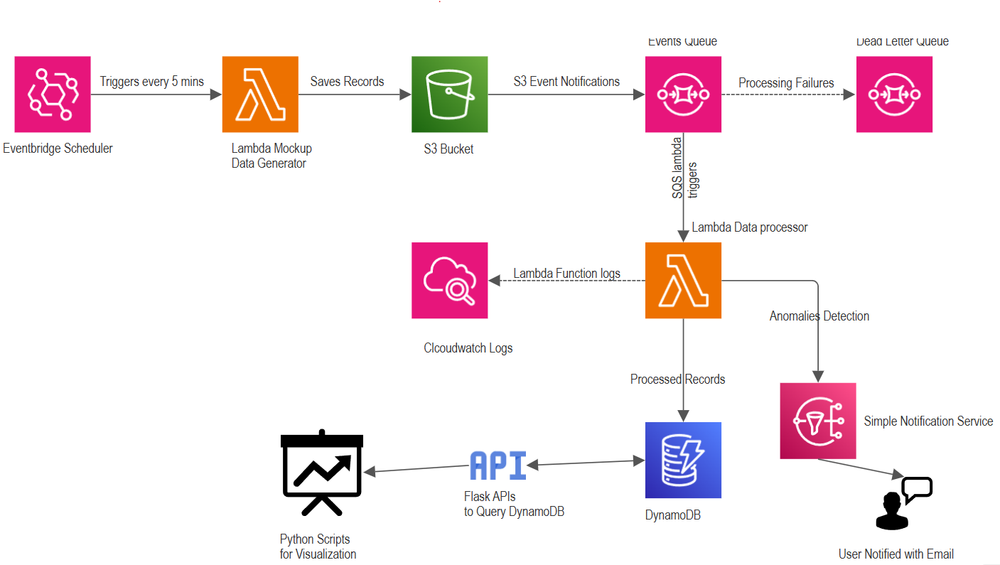

# Energydata_AWS_streaming_data_pipeline

Challenge deials are present in Data_Engineering_Assignment.pdf. Its a assesment carried for a energy firm

## Design

### Video Demo : [AWS data pipeline demo](https://drive.google.com/file/d/1B-u0bbsLJBmErbqR9UKGvm4-jkwNfGVf/view?usp=sharing)

# Instructions to Set Up and Run the Pipeline

1. Clone the repo [Energydata_AWS_streaming_data_pipeline](https://github.com/hari7696/Energydata_AWS_streaming_data_pipeline.git)
2. The `AWS_CLI_Infrra.sh` file contains the AWS CLI commands to create the resources.
3. Each command is commented on with information about what’s being created.
4. At a couple of places, I couldn’t figure out doing certain actions via CLI, so I performed those via the console and commented the same in the script.
5. I strongly recommend running the commands one by one instead of running the whole script.
6. The Lambda functions are zipped with the required packages and stored in `lambda_zips`.
7. Trust policies and roles are in the `policies` folder.

---

## **Design Decisions**

### **Simulated Data Feed**
1. **Lambda Usage:** Chose Lambda for its flexibility and cost-effectiveness over EC2, which would require a continuous runtime.
2. **Event Scheduling:** EventBridge is utilized to trigger Lambda functions at specified intervals, ensuring timely data generation.

### **Processing Strategy**
- **Initial Approach:** Initially considered direct Lambda triggers via S3 Event notifications but decided against it due to potential visibility issues with failed events and the limitation of Lambda execution concurrency, which is capped at 1000. Additionally, this method does not support batch processing, as every event triggers a new Lambda instance independently.
- **Alternative Considered:** Explored using AWS Data Migration Service and Kinesis, which would involve streaming S3 events to Kinesis Data Streams and then using Kinesis Data Analytics for anomaly detection and transformations, finally employing Kinesis Firehose with Lambda to write records to DynamoDB. However, this setup seemed like overengineering and too expensive for the needs. Notably, S3 events do not natively support writing to Kinesis streams, requiring additional SDK development. Moreover, integrating Kinesis Data Analytics would still necessitate multiple Lambda functions, further complicating the architecture without clear benefits.
- **Chosen Solution:** Opted for an SQS queue to decouple processing tasks. This approach provides failure logging capabilities and supports batch processing, allowing a Lambda function to process multiple files simultaneously. Lambda now supports partial batch success, so if one event fails, we don’t have to discard the entire batch. The SQS queue is scalable, supports up to 10,000 messages, and allows setting concurrency limits on Lambda to avoid throttling. If Lambda does not report success after 3 retries, it moves the events to a Dead Letter Queue (DLQ) for further investigation.

### **Data Processing**
- **Lambda Functions:** Chosen for their serverless and scalable nature and ease of integration with CloudWatch for effortless logging. Despite the multiple actions in a single Lambda function—reading records from S3, transforming data, identifying anomalies, writing to DynamoDB, and triggering SNS notifications—the AWS SDK simplifies these operations into a few lines of Python code. The code is written to handle failures gracefully; for instance, if writing to DynamoDB fails, it pushes the event to a DLQ. If sending a notification fails, it logs a message in CloudWatch but does not send it to DLQ.

### **Data Storage**

#### **DynamoDB Configuration**
- **Initial Setup Overthought:** Initially created the `anomaly` attribute as a Boolean based on the task description [`anomaly` (boolean)].
- **GSI Creation Issue:** During the API development, I needed to filter on `anomaly`, which is neither a partition key nor a sort key. So I created a GSI. While creating the GSI, the `anomaly` data type was taken as a String; it did not let me opt for it as a Boolean. After that, when I queried the GSI, I was not getting any records. I tried creating the GSI multiple times to make sure I did nothing wrong, but to no avail. Finally, I realized that I cannot create a GSI on a Boolean field. I went with data filtering in API development.

### **APIs for Querying Data**
- **Framework Choice:** Used Flask for API development due to familiarity. In the interest of simplicity and saving time, developed and tested them locally.
    - `/fetchrecords`  - to retrieve specific records for the given site and date range.
    - `/fetchanomalies` - to filter and fetch anomaly data for the given site.
    - `/fetchall` - for complete data scan.

### **Data Visualization**
- **Tools Used:** Leveraged Jupyter notebooks to develop visualizations, using APIs developed above to query data.
- **Libraries:** Used Python libraries such as pandas for data manipulation and matplotlib for plotting.

---

## **Extra Credit**

### **1. Real-Time Alerting**
While writing to DynamoDB itself, identified anomalies are notified to users with the AWS SNS service.

### **2. Error Handling for Failure Cases**
All the processing failed files are logged to a Dead Letter Queue (DLQ).

